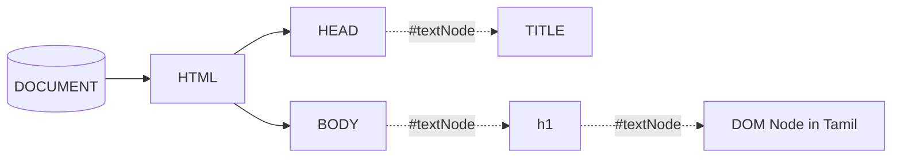

# What is DOM Nodes?	

<v-click>

Nodes are in the <span class="highlight">DOM(Document Object model)</span>. In the DOM, all parts of the document, such as <span class="highlight">elements, attributes, text, etc</span>. are organized in a hierarchical tree-like structure; consisting of parents and children. <a href="https://software.hixie.ch/utilities/js/live-dom-viewer/" target="_blank" class="hover:bg-orange-500 px-2 py-1 text-xs rounded highlight">🎉 Live Demo</a>

</v-click>


<v-click>

```html {1,8|1,2,4,8|1,2,4,5,7,8|1,2,4,5,7,8,3|1,2,3,4,5,7,8,6|}
<html>
    <head>
        <title>DOM Node</title>
    </head>
    <body>
        <h1>DOM Node in Tamil</h1>
    </body>
</html>
```

</v-click>

<v-click>



</v-click>

<style>
.slidev-layout {
    line-height: 1.5 !important;
}
</style>
