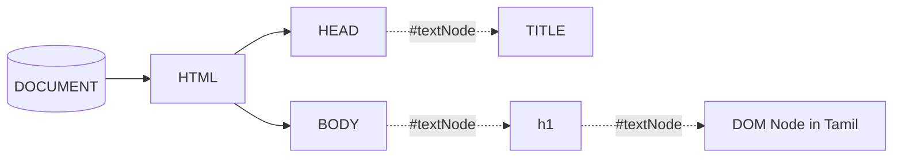

# What is DOM Nodes?	

Nodes are in the <span class="text-white">DOM(Document Object model)</span>. In the DOM, all parts of the document, such as <span class="text-white">elements, attributes, text, etc</span>. are organized in a hierarchical tree-like structure; consisting of parents and children. <a href="https://software.hixie.ch/utilities/js/live-dom-viewer/" target="_blank" class="hover:bg-orange-500 px-2 py-1 text-xs rounded text-white">🎉 Live Demo</a>

```html
<html>
    <head>
        <title>DOM Node</title>
    </head>
    <body>
        <h1>DOM Node in Tamil</h1>
    </body>
</html>
```

<!-- ::right:: -->



<template v-slot:refvideo>
    <iframe src="https://www.youtube.com/embed/SlLTuWYa7UM" allowfullscreen></iframe>
</template>

<style>
.slidev-layout {
    line-height: 1.5 !important;
}
</style>
